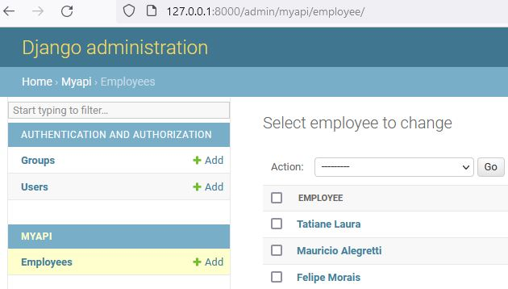
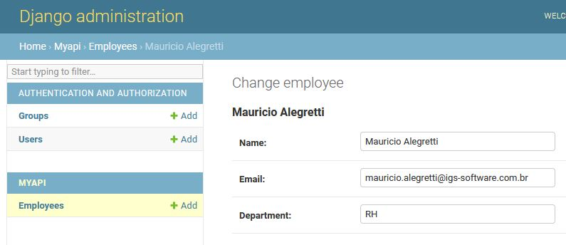

# API REST Django
##  Coding Test IGS International
Django REST framework
<br>
  <div align="center">
    <table>
      </tr>
            <td>
                <a  href="https://www.linkedin.com/in/robinsonbrz/">
                Robinson Enedino
            </td>
        <td>
            <a  href="https://www.linkedin.com/in/robinsonbrz/">
            </a>
        </td>
        <td>
            <a  href="https://www.linkedin.com/in/robinsonbrz/">
            
        </td>
        <td>
            <a href="mailto:robinsonbrz@gmail.com">
            </a>
        </td>
      </tr>
    </table>
  </div>

Visite meu WebSite em Django [https://www.enedino.com.br](https://www.enedino.com.br)

Portfólio com diversas apps implementadas inclusive FastAPI com MongoDB

  <br>

___

### Simple API with a 3 fields model
___
Data can be managed through Admin panel with an admin password 

http://127.0.0.1:8000/admin/


<a  href="https://www.linkedin.com/in/robinsonbrz/">
            </a>

<a  href="https://www.linkedin.com/in/robinsonbrz/">
            </a>
<br>
<br>

_______

### And as an REST API you can use HTTP methods to send and request data as well

Get a full list of employees

All employees endpoint [http://127.0.0.1:8000/employee/](http://127.0.0.1:8000/employee/)


______


## Utilização do programa 

Antes de executar o programa é necessário criar o ambiente virtual Python venv

```python
python -m venv venv
```
Ativar o ambiente virtual
```python
.\venv\Scripts\activate
```
Instalar as dependências do projeto

```python
pip instal -r requirements.txt
```
Agora podemos executar o programa
```python
python manage.py runserver
```


<br>

<br>
<br>


<h1 align="center"> Informações e contato </h1> 
  <div align="center">
    <table>
        </tr>
            <td>
                <a  href="https://www.linkedin.com/in/robinsonbrz/">
                
            </td>
            <td>
                <a  href="https://www.linkedin.com/in/robinsonbrz/">
                
            </td>
            <td>
                <a href="https://www.enedino.com.br/contato">
                
            </td>
        </tr>
    </table> 
  </div>